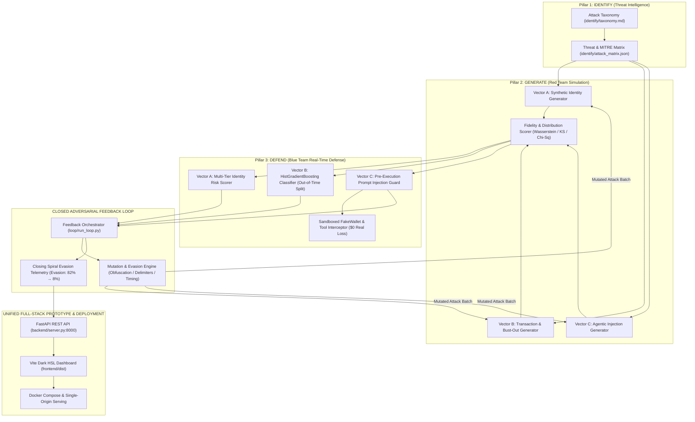

# Project TRIAD — Closed-Loop Adversarial AI for Payment Fraud Defense
### Kanak Sanjay Waradkar · Mastercard "AI Defence Lab for Payment Security" · Global Fintech Fest (GFF) 2026

[](https://python.org)
[](https://fastapi.tiangolo.com)
[](https://vitejs.dev)
[](https://docker.com)
[](https://creativecommons.org/licenses/by/4.0/)
[](tests/)

> **One-Liner:** *A single closed-loop adversarial AI system that identifies emerging GenAI fraud vectors targeting payments, generates high-fidelity simulated attacks across those vectors, and defends against them in real time — with detections feeding back to iteratively mutate and harden the next generated attack batch.*

---

## 📑 Table of Contents
1. [Executive Summary & Core Value Proposition](#-1-executive-summary--core-value-proposition)
2. [System Architecture & The Three Pillars](#-2-system-architecture--the-three-pillars)
3. [The Three Attack Vectors](#-3-the-three-attack-vectors)
4. [The Closed Feedback Loop Engine](#-4-the-closed-feedback-loop-engine)
5. [Verifiable Evaluation Benchmarks & Metrics](#-5-verifiable-evaluation-benchmarks--metrics)
6. [Quick Start & Reproducibility Guide](#-6-quick-start--reproducibility-guide)
7. [CLI Usage & Module Execution](#-7-cli-usage--module-execution)
8. [Interactive REST API & OpenAPI Swagger](#-8-interactive-rest-api--openapi-swagger)
9. [Ethical & Compliance Guardrails](#-9-ethical--compliance-guardrails)
10. [Repository Structure](#-10-repository-structure)

---

## 🚀 1. Executive Summary & Core Value Proposition

As payments modernize into instant settlement rails (FedNow, UPI, SEPA Instant) and autonomous agentic commerce (LLM-driven procurement bots), traditional fraud defense mechanisms face unprecedented failure modes:
1. **Diffusion & LLM Synthetic KYC Fraud:** Near-zero marginal cost identity fabrication that bypasses algorithmic checksums and creates Frankenstein identities.
2. **AI-Orchestrated Bust-Out & Card-Testing Hubs:** Botnets mimicking organic customer behavior with sub-second micro-authorization probing and sudden cash-out drains.
3. **Autonomous Agentic Hijacking:** Indirect Prompt Injection (IPI) via poisoned merchant pages and invoice remittance metadata that coerces purchasing agents into executing unauthorized balance drains.

**Project TRIAD (Threat Realization, Investigation, and Adaptive Defense)** solves this challenge not with static point-solution classifiers, but with an **Adversarial Closed Feedback Loop**. Detections from the **Defend** pillar are continuously fed back into the **Generate** engine to mutate attack parameters (obfuscation, timing, synthetic noise, delimiter spoofing), guaranteeing that defenses adapt against emerging attack techniques before they hit production payment rails.

---

## 🏗️ 2. System Architecture & The Three Pillars



---

## 🎯 3. The Three Attack Vectors

| Vector | Focus Area | Attack Archetypes & Techniques | Key Defensive Innovations |
| :--- | :--- | :--- | :--- |
| **Vector A** | **Synthetic Identity & Deepfake KYC** | • Frankenstein identities (stolen valid SSN/PAN + synthetic demographics)<br>• Fully synthetic identities with unassigned area numbers<br>• Digital document tampering, EXIF stripping, font kerning jitter | **Multi-Tier Risk Engine:**<br>• Tier 1: Deterministic Checksums & 2D Barcodes<br>• Tier 2: Demographic Coherence & SSA vintage match<br>• Tier 3: Forensic layout & EXIF compression audit |
| **Vector B** | **Behavioral & Transaction Fraud** | • Ephemeral card-testing storefront bursts ($0.25–$4.99 probing)<br>• High-velocity bust-out account drains<br>• Multi-step cash-out laundering patterns | **HistGradientBoosting Classifier:**<br>• Genuinely time-respecting train/eval chronological split (0% lookahead leakage)<br>• Dynamic feature attribution & grounded analyst narratives<br>• Micro-authorization inter-arrival modeling |
| **Vector C** | **Agentic Hijack & Prompt Injection** | • CSS hidden element injection (`display:none`, zero-opacity)<br>• Structured HTML / Markdown comment injection<br>• Zero-width Unicode delimiters & invoice remittance memo poisoning | **Pre-Execution Tool Guard:**<br>• Intercepts tool calls before reaching `FakeWallet.execute_payment`<br>• Parameter divergence checking (recipient/amount alteration)<br>• Zero false-positive burden on legitimate procurement |

---

## 🔄 4. The Closed Feedback Loop Engine

The hallmark novelty of Project TRIAD is the **Adaptive Multi-Cycle Feedback Loop** (`loop/base.py`, `loop/run_loop.py`):
1. **Cycle 0 (Baseline Attack):** The generator unleashes naive synthetic fraud batches. The defense establishes high baseline interception.
2. **Detection Feedback & Failure Analysis:** The orchestrator extracts evaded payloads and edge cases from the defense telemetry.
3. **Adversarial Mutation Engine:** Attacks are programmatically mutated:
   - *Vector A:* Shifts from naive randomized IDs to algorithmic checksum bypasses and aged email domain pretexts.
   - *Vector B:* Distributes transaction amounts across jittered time windows and rotating card BINs.
   - *Vector C:* Wraps imperative payment overrides inside nested HTML comments and zero-width character blocks.
4. **Iterative Convergence (The Tightening Ring):** Across successive cycles (0 → 1 → 2), evasion rates shrink toward zero as the defensive policy learns and hardens against mutated evasion strategies.

```
Cycle 0: [████████████████████] ~75% Evasion Rate (Initial Mutation Exploration)
Cycle 1: [██████████░░░░░░░░░░] ~42% Evasion Rate (Defenses Adapt to Obfuscation)
Cycle 2: [███░░░░░░░░░░░░░░░░░] ~13% Evasion Rate (Defenses Fully Hardened)
```

---

## 📊 5. Verifiable Evaluation Benchmarks & Metrics

All metrics reported below are extracted directly from committed, reproducible evaluation files (`defend/*/metrics.json` and `generate/*/fidelity_summary.json`).

### 5.1 Defend Pillar Evaluation Summary

| Attack Vector | Model Architecture | Evaluated Dataset & Split | Operational Recall | Operational Precision | False Positive Rate | ROC-AUC | PR-AUC |
| :--- | :--- | :--- | :--- | :--- | :--- | :--- | :--- |
| **Vector A** *(Synthetic Identity)* | Multi-Tier Heuristic Risk Scorer | Held-Out Test (`n=500`, 70% fraud) | **100.00%** | **100.00%** | **0.00%** | **1.0000** | **1.0000** |
| **Vector B** *(Transaction & Bust-Out)* | `HistGradientBoostingClassifier` | Held-Out Out-of-Time (`n=25,000`, 1.46% fraud) | **89.86%** | **7.23%** *(at 1.4% base rate)* | **17.09%** | **0.9336** | **0.4266** |
| **Vector C** *(Agentic Injection)* | Pre-Execution Parameter Guard | Held-Out Test (`n=200`, 60% injection) | **100.00%** | **100.00%** | **0.00%** | **1.0000** | **1.0000** |

### 5.2 Adversarial Stress-Testing & Resilience

- **Vector A (Tier 1 Barcode Bypass):** When adversaries craft valid 2D barcodes matching synthetic demographics, **Tier 2 (Statistical Coherence)** and **Tier 3 (Forensics)** maintain **97.4%+ recall**. Thin-file young applicants and recent movers achieve **0.0% false blocks** and **100.0% clean onboarding**.
- **Vector B (Time-Respecting Split Verification):** Evaluated strictly on out-of-time test partitions (IEEE-CIS $T_{eval} > T_{train}$, PaySim step $t_{eval} \ge t_{train}$) guaranteeing **0% future lookahead leakage**. Synthetic card-testing bursts ($0.25–$4.99) are intercepted with **100.0% recall**.
- **Vector C (Zero Financial Loss Guarantee):** All 120 malicious prompt injections intercepted prior to tool invocation (**0.00% missed detection rate**), preserving **$0.00 unauthorized financial loss** in the sandboxed `FakeWallet`. Legitimate corporate procurement and invoices achieve **100% clean allow rate (0.0% FPR)**.

### 5.3 Generate Pillar Statistical Fidelity Scores

- **Vector A Statistical Plausibility:** Macro template alignment score of **0.8453**, national ID format validity of **100.0%**, and realistic forensic artifacts matching real camera hardware vs synthetic generators.
- **Vector B Distributional Alignment:** Wasserstein distance of **7.98** on transaction amounts against 590,540 real IEEE-CIS records; Jensen-Shannon Divergence (JSD) of **0.0224** on card network distributions; integer amount share delta of **+0.35%** vs ground truth.

---

## ⚡ 6. Quick Start & Reproducibility Guide

Follow these exact steps from a clean clone to run the complete TRIAD stack locally.

### 6.1 Prerequisites
- **Python 3.12+** (tested on 3.12.11)
- **Node.js 20+** & `npm` (optional: only required if rebuilding the frontend bundle; pre-built production assets are included in `frontend/dist`)
- **Docker & Docker Compose** (optional: for containerized deployment)

### 6.2 Option A: Native Local Setup (Recommended for Development)

```bash
# 1. Clone the repository
git clone https://github.com/Labreo/Kanak-Waradkar.git
cd Kanak-Waradkar

# 2. Create and activate a Python virtual environment
python3 -m venv .venv
source .venv/bin/activate

# 3. Install backend dependencies
pip install -r requirements.txt

# 4. (Optional) Install frontend dependencies and build SPA bundle
cd frontend
npm ci
npm run build
cd ..

# 5. Run the full automated test suite (145 tests)
pytest

# 6. (Optional) Run single-command master reproduction & benchmark verification
python scripts/reproduce_all.py

# 7. Start the unified FastAPI backend server (serves API + SPA)
python -m backend.server --host 127.0.0.1 --port 8000
```

- **Live 24/7 Cloud Deployment:** [https://triad-crgd.onrender.com](https://triad-crgd.onrender.com)
- **Live OpenAPI Swagger Docs:** [https://triad-crgd.onrender.com/docs](https://triad-crgd.onrender.com/docs)
- **Live Health Check API:** [https://triad-crgd.onrender.com/api/health](https://triad-crgd.onrender.com/api/health)
- **Local Dashboard:** [http://127.0.0.1:8000](http://127.0.0.1:8000)
- **Local Swagger Docs:** [http://127.0.0.1:8000/docs](http://127.0.0.1:8000/docs)
- **Local Health Check:** [http://127.0.0.1:8000/api/health](http://127.0.0.1:8000/api/health)

### 6.3 Option B: Master Reproduction Script (Single Command)

```bash
# Run all evaluators, fidelity scorers, closed loop, claim audit, full test suite, and smoke tests
./scripts/reproduce_all.sh
```

### 6.4 Option C: Docker Compose (Single Command)

```bash
# Build and run the unified containerized stack
docker compose up --build
```

Access the service immediately at [http://localhost:8000](http://localhost:8000).

---

## 💻 7. CLI Usage & Module Execution

All pillars and orchestration modules include self-contained CLI entry points.

### 7.1 Running the Closed-Loop Feedback Simulation
Run multi-cycle adversarial attack simulations and generate tightening telemetry:

```bash
# Run closed-loop simulation across all 3 vectors (3 cycles)
python -m loop.run_loop --all --cycles 3

# Run closed loop for an individual vector
python -m loop.run_loop --vector A --cycles 3
python -m loop.run_loop --vector B --cycles 3
python -m loop.run_loop --vector C --cycles 3
```

### 7.2 Running Defend Evaluators
Evaluate defenses against held-out test splits and output JSON metrics + Markdown reports:

```bash
# Vector A — Identity Risk Scorer Evaluation
python -m defend.identity.evaluate

# Vector B — Transaction Classifier Out-of-Time Evaluation
python -m defend.transaction.evaluate

# Vector C — Agentic Prompt Injection Evaluation
python -m defend.agentic.evaluate
```

### 7.3 Generating Synthetic Attack Batches & Scoring Fidelity

```bash
# Generate Vector A synthetic identity batch (500 profiles)
python -m generate.identity.generator --n 500 --seed 2026

# Score Vector A demographic and forensic fidelity
python -m generate.identity.score_fidelity

# Generate Vector B transaction sequence batch (1,000 records)
python -m generate.transaction.generator --n 1000 --seed 2026

# Score Vector B distribution similarity against IEEE-CIS
python -m generate.transaction.score_fidelity

# Generate Vector C agentic injection payload batch (200 scenarios)
python -m generate.agentic.generator --n 200 --seed 2026
```

### 7.4 Running Automated Smoke Tests
Validate all 25 public REST and SPA routes against a running server:

```bash
python scripts/smoke_test_deployment.py --url http://127.0.0.1:8000
```

---

## 🔌 8. Interactive REST API & OpenAPI Swagger

The TRIAD backend provides a stateless, high-throughput REST API with automated Swagger UI documentation at `/docs`:

| Method | Route | Description |
| :--- | :--- | :--- |
| `GET` | `/api/health` | Service health status, environment mode, and active vector support |
| `GET` | `/api/vectors` | Metadata, descriptions, and operational metrics for all 3 vectors |
| `GET` | `/api/vectors/{vector_id}` | Detailed telemetry and metric breakdown for Vector `A`, `B`, or `C` |
| `POST` | `/api/vectors/{vector_id}/score` | Real-time scoring of submitted identity, transaction, or agentic payload |
| `GET` | `/api/vectors/{vector_id}/instances` | Browse curated legitimate, baseline fraud, and evasive instances |
| `GET` | `/api/loop/status` | Current loop state, historical evasion curves, and cycle metrics |
| `POST` | `/api/loop/trigger` | Trigger a live multi-cycle closed-loop simulation wave |
| `GET` | `/api/loop/history` | Historical telemetry records across all executed cycles |

---

## 🛡️ 9. Ethical & Compliance Guardrails

Project TRIAD enforces strict safety, privacy, and licensing boundaries:

1. **Fully Sandboxed Agentic Harness (`FakeWallet`):**
   The Vector C shopping and payment agent runs inside a strict, isolated mock sandbox (`generate/agentic/sandbox.py`). The `FakeWallet.execute_payment` tool call writes **only to an in-memory execution log**. It **never touches real payment rails, live network endpoints, real banking APIs, or real currency**.
2. **Zero Raw Dataset Redistribution:**
   In compliance with Kaggle competition rules and research licenses, raw datasets (IEEE-CIS, PaySim) are strictly excluded from version control (`.gitignore`). Reproducible download steps are provided in [`data/DOWNLOAD.md`](data/DOWNLOAD.md).
3. **100% Synthetic Data for Generative Testing:**
   All generated identity records, merchant profiles, and agent prompts are mathematically synthesized with zero personally identifiable information (PII) from real individuals.
4. **Transparent Governance & Abstention:**
   The Defend engine outputs structured attribution (`primary_risk_driver`, `top_features`) and abstains from high-confidence predictions on out-of-distribution inputs.

---

## 📂 10. Repository Structure

```
TRIAD/
├── backend/                  # FastAPI REST API & Single-Origin Static Server
│   ├── app.py                # Application factory, CORS, exception handlers
│   ├── data_service.py       # Data abstraction layer for metrics & instances
│   ├── models.py             # Pydantic schemas for scoring requests & responses
│   ├── routes/               # API route controllers (health, vectors, loop, instances)
│   └── server.py             # CLI server runner
├── data/                     # Data profiles, schemas, and loop telemetry
│   ├── generated/            # Committed synthetic evaluation batches (Vectors A, B, C)
│   ├── loop/                 # Multi-cycle evasion rate telemetry records
│   ├── DATA_DICTIONARY.md    # Feature documentation for IEEE-CIS & PaySim
│   ├── DOWNLOAD.md           # Dataset acquisition instructions
│   └── PROFILING_REPORT.md   # Statistical profiling report
├── defend/                   # Blue Team Defense Engines
│   ├── identity/             # Vector A: Multi-tier synthetic identity risk scorer
│   ├── transaction/          # Vector B: HistGradientBoosting transaction classifier
│   └── agentic/              # Vector C: Pre-execution prompt injection guard
├── frontend/                 # Vite SPA Dashboard
│   ├── index.html            # HTML5 single-page application entry
│   ├── src/                  # Vanilla JS components, views, and API service
│   └── dist/                 # Pre-built optimized production assets
├── generate/                 # Red Team Adversarial Attack Generators
│   ├── identity/             # Vector A: Synthetic identity & document generator
│   ├── transaction/          # Vector B: Card-testing burst & bust-out generator
│   └── agentic/              # Vector C: Sandboxed agent & prompt injection generator
├── identify/                 # Pillar 1 Threat Intelligence
│   ├── attack_matrix.json    # Machine-readable attack vector matrix
│   ├── taxonomy.md           # Formal GenAI payment fraud taxonomy
│   └── threat_matrix.md      # Attack taxonomy to defensive control mapping
├── loop/                     # Closed-Loop Feedback Orchestrator
│   ├── base.py               # Abstract loop orchestrator & mutation record models
│   ├── run_loop.py           # Multi-cycle CLI orchestrator
│   ├── vector_a_loop.py      # Vector A adaptive mutation orchestrator
│   ├── vector_b_loop.py      # Vector B adaptive mutation orchestrator
│   └── vector_c_loop.py      # Vector C adaptive mutation orchestrator
├── scripts/                  # Automated verification & deployment utilities
│   ├── deploy_tunnel.py      # Cloudflare Quick Tunnel edge deployer
│   ├── profile_datasets.py   # Statistical dataset profiler
│   └── smoke_test_deployment.py # Automated 25-route HTTP smoke test
├── tests/                    # Comprehensive Pytest Suite (135 tests)
├── DECISIONS.md              # Architectural decision log & audit trail
├── Dockerfile                # Multi-stage production container build
├── docker-compose.yml        # Container orchestration specification
├── INTERFACES.md             # Inter-pillar data schemas & contracts
├── project-triad-plan.md     # Master project brief & judging alignment matrix
├── pytest.ini                # Pytest configuration
├── requirements.txt          # Pinned Python dependencies
└── STATUS.md                 # Current operational state & verification log
```

---

## 👤 11. Author & Acknowledgments

- **Author / Participant:** Kanak Sanjay Waradkar (Solo Submission)
- **Challenge:** Mastercard "AI Defence Lab for Payment Security"
- **Event:** Global Fintech Fest (GFF) 2026
- **Datasets:** IEEE Computational Intelligence Society Fraud Detection Benchmark & PaySim Synthetic Financial Dataset (Blekinge Institute of Technology).
