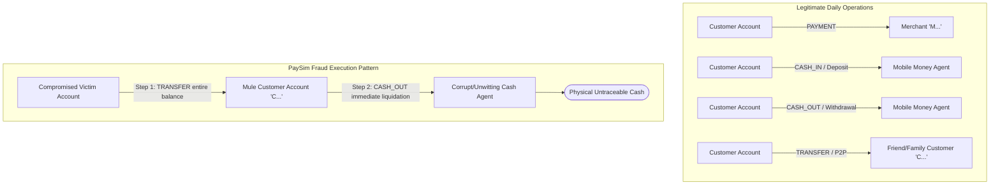

# TRIAD Data Dictionary: IEEE-CIS & PaySim

This document provides a comprehensive, plain-language reference for all column families, engineered features, target variables, and domain representations across the two foundational datasets used in Project TRIAD.

---

## 1. IEEE-CIS Fraud Detection Dataset

- **Source / Provider**: IEEE Computational Intelligence Society & Vesta Corporation
- **Kaggle URL**: [https://www.kaggle.com/c/ieee-fraud-detection](https://www.kaggle.com/c/ieee-fraud-detection)
- **License / Usage Terms**: Kaggle Competition Rules / Academic & Non-Commercial Research Use.
- **Dataset Structure**: Split across two tables linked by `TransactionID`:
  1. `train_transaction.csv` (590,540 rows, 394 columns) / `test_transaction.csv` (506,691 rows, 393 columns)
  2. `train_identity.csv` (144,233 rows, 41 columns) / `test_identity.csv` (141,907 rows, 41 columns)

### 1.1 Column Families Overview (Transaction Table)

| Column Family | Field Count | Data Types | Plain-Language Domain Meaning |
| :--- | :--- | :--- | :--- |
| `TransactionID` | 1 | Integer (Key) | Unique 7-digit transaction identifier; join key between Transaction and Identity tables. |
| `isFraud` | 1 | Binary (0/1) | **Target Ground Truth**: `1` = Fraudulent transaction, `0` = Legitimate transaction (~3.5% positive class balance in training set). |
| `TransactionDT` | 1 | Numeric (Seconds) | Timedelta in seconds from an undisclosed reference timestamp ($t_0$). Train covers ~182 days; test covers a subsequent ~183 days. |
| `TransactionAmt` | 1 | Float (USD) | Transaction payment amount in USD. Exhibits decimal fraction patterns reflecting currency conversion and rounding. |
| `ProductCD` | 1 | Categorical (5 values) | Product line / transaction channel code (`W`, `C`, `R`, `H`, `S`). Represents distinct commerce environments with varying fraud baselines. |
| `card1` – `card6` | 6 | Categorical & Numeric | Payment card attributes (BIN, issuer bank, country code, network scheme, bank subcategory, funding type). Combined, they identify cardholder personas. |
| `addr1`, `addr2` | 2 | Categorical (Numeric ID) | Geographic location codes: `addr1` = Billing region / ZIP-level code; `addr2` = Billing country code. |
| `dist1`, `dist2` | 2 | Numeric (Distance) | Distance metrics between billing address, delivery/shipping address, and issuing bank geolocation. |
| `P_emaildomain`, `R_emaildomain` | 2 | Categorical (String) | Purchaser (`P`) and Recipient (`R`) email service providers. Domain mismatches and disposable providers provide strong anomaly signals. |
| `C1` – `C14` | 14 | Integer (Counts) | **Velocity & Entity Counters**: Proprietary counting features calculated by Vesta (counts of distinct cards, IP addresses, emails, and device associations over rolling time windows). |
| `D1` – `D15` | 15 | Numeric (Days) | **Timedeltas & Recency**: Elapsed time in days between previous transactions, card issuance, device changes, or account profile edits. |
| `M1` – `M9` | 9 | Categorical (`T`/`F`/`M...`) | **Entity Verification & Match Indicators**: Boolean/categorical match flags (e.g., name on card matching shipping name, address consistency, 3DS authentication code). |
| `V1` – `V339` | 339 | Float (Engineered) | **Vesta Rich Engineered Features**: Multi-dimensional behavioral, device ranking, graph-based risk scores, and cross-entity aggregation metrics. |

---

### 1.2 Deep Dive: IEEE-CIS Transaction Feature Families

#### Primary Keys & Target
- **`TransactionID`**: Sequential unique identifier assigned to every payment transaction attempt.
- **`isFraud`**: Binary ground truth label verified through chargeback logs, merchant dispute resolutions, and manual fraud investigation reviews.

#### Temporal & Financial Quantities
- **`TransactionDT`**: Monotonically increasing timedelta measuring elapsed seconds since dataset epoch ($t_0$).
  - Modulo arithmetic ($t \pmod{86400}$) extracts the **hour of the day** (circadian rhythm).
  - Division by 86,400 yields the **transaction day**, enabling analysis of weekly transaction volume cycles and holiday seasonality.
- **`TransactionAmt`**: Transaction value in US Dollars.
  - Distribution is heavily right-skewed with long tails and characteristic decimal fractional clusters (e.g., `.00`, `.50`, `.99` vs. decimal currency conversion artifacts).

#### Transaction Environment (`ProductCD`)
Categorical product segment code representing distinct purchasing workflows:
- `W` (**Web / E-Commerce Retail**): General physical/digital retail purchases (highest volume, moderate fraud rate).
- `C` (**Commercial / Checkout Services**): Merchant-to-merchant, micro-payments, or international checkout gateways (high cross-border fraud risk).
- `R` (**Recurring / Digital Services**): Subscription renewals, digital goods, and gift-card purchases (high velocity attack vector).
- `H` (**High-Risk / Hosted Checkout**): Identity-gated or hosted checkout portals.
- `S` (**Stored Value / Specialized Services**): Digital wallets, stored credit, and gift card reloads.

#### Payment Card Persona Cluster (`card1` – `card6`)
In fraud prevention architectures, these six fields form a composite "card persona fingerprint":
- **`card1`**: Payment Card Issuer Identification Number (BIN / IIN sub-cluster). High cardinality (~13,500 unique values).
- **`card2`**: Regional bank code, program branch, or risk-scoring division.
- **`card3`**: Numeric country code of the card-issuing financial institution.
- **`card4`**: Card network brand scheme (e.g., `visa`, `mastercard`, `discover`, `american express`).
- **`card5`**: Bank category and issuing tier classification code.
- **`card6`**: Payment funding type (e.g., `debit`, `credit`, `debit or credit`, `charge card`).

#### Geographic & Physical Distance (`addr1`, `addr2`, `dist1`, `dist2`)
- **`addr1`**: Anonymized billing region, state, or metropolitan area code.
- **`addr2`**: Anonymized billing nation code.
- **`dist1`**: Physical or network distance metric between purchaser billing address and shipping destination or IP geolocation.
- **`dist2`**: Physical distance metric between purchaser billing address and card issuing bank headquarters. Large values indicate cross-border or foreign card usage.

#### Email Domain Intelligence (`P_emaildomain`, `R_emaildomain`)
- **`P_emaildomain`**: Email service domain used by the purchaser (e.g., `gmail.com`, `yahoo.com`, `anonymous.com`, `protonmail.com`).
- **`R_emaildomain`**: Email service domain of the order recipient. Null in transactions without separate recipient addresses.
- *Fraud Significance*: Discrepancies between purchaser and recipient domains, or the use of temporary/disposable domains, strongly correlate with synthetic identity and account takeover fraud.

#### Velocity & Entity Counters (`C1` – `C14`)
Proprietary velocity metrics calculated by Vesta's risk engine across rolling time horizons (1 hour, 24 hours, 7 days, 30 days, all-time):
- Measure the frequency of distinct transactions associated with the same card persona, IP subnet, device fingerprint, or billing address.
- Sudden spikes in `C` values indicate automated credential stuffing, brute-force card testing, or botnet replay attacks.

#### Timedelta Recency Features (`D1` – `D15`)
Elapsed days between previous security events and the current transaction:
- **`D1`**: Days since card persona's first recorded transaction.
- **`D2`**: Days since previous transaction on the same card persona.
- **`D3`**: Days since last transaction on the same device or IP.
- **`D4` – `D15`**: Days elapsed since specific security events (password reset, email change, address change, first card issuance).
- *Progression*: In legitimate recurring transactions, $D$ features increase linearly ($D_{t+1} = D_t + \Delta t$). Abrupt resets or anomalous jumps indicate identity fabrication or stolen credentials.

#### Match Indicators (`M1` – `M9`)
Categorical and boolean validation flags comparing transaction attributes:
- **`M1` – `M3`**: Match between name on card, purchaser name, and shipping recipient name (`T` = Match, `F` = Mismatch).
- **`M4`**: 3-D Secure authentication level / challenge method code (`M0`, `M1`, `M2`).
- **`M5` – `M9`**: Match indicators between billing address, shipping address, contact phone number, and email prefix.

#### Vesta Rich Engineered Features (`V1` – `V339`)
A high-dimensional feature family representing behavioral statistics, device graph scores, and risk aggregations. They cluster into distinct structural groups:
- **`V1` – `V11`**: Card persona verification scores and device risk scores.
- **`V12` – `V34`**: Short-window transaction velocity counts (1-hour and 24-hour windows).
- **`V35` – `V52`**: Match consistency scores between device fingerprint, browser locale, and billing region.
- **`V53` – `V74`**: Velocity counts of failed authorization attempts and previous chargeback flags.
- **`V75` – `V94`**: Cumulative spending aggregates over rolling windows (7-day and 30-day sums).
- **`V95` – `V137`**: Clickstream velocity, rapid page transitions, and session authorization duration.
- **`V138` – `V166`**: Identity bureau and external risk engine confidence scores.
- **`V167` – `V216`**: Cross-card and cross-account graph connectivity metrics (identifying mule rings).
- **`V217` – `V278`**: Normalized graph embeddings and high-dimensional behavioral proximity scores.
- **`V279` – `V321`**: Spending deviation metrics (ratio of current amount to 30-day moving average).
- **`V322` – `V339`**: Proxy, VPN, and TOR exit node detection risk indicators.

---

### 1.3 Deep Dive: IEEE-CIS Identity Table (`train_identity.csv` / `test_identity.csv`)

The Identity table records network, browser, and hardware telemetry gathered when transactions pass through identity verification, 3-D Secure challenges, or browser fingerprinting. Present for ~25–30% of transactions.

| Column Family | Field Count | Data Types | Plain-Language Domain Meaning |
| :--- | :--- | :--- | :--- |
| `DeviceType` | 1 | Categorical (`desktop`, `mobile`) | Hardware category of the client device. |
| `DeviceInfo` | 1 | Categorical (String) | User-Agent string / hardware model identifier (e.g., `Windows`, `iOS Device`, `SM-G950U`, `MacOS`, `Trident/7.0`, `Moto G`). |
| `id_01` – `id_11` | 11 | Numeric (Float) | Quantitative identity metrics: IP risk score, proxy confidence index, network latency, screen aspect ratio, battery level metrics. |
| `id_12` – `id_38` | 27 | Categorical (String/Code) | System telemetry: Browser name/version (`chrome 66.0`, `safari`), OS name/version (`Android 7.0`, `Windows 10`), screen resolution (`1920x1080`), system language (`en-us`), proxy presence (`Found`/`NotFound`). |

---

## 2. PaySim Synthetic Financial Dataset

- **Source / Provider**: Blekinge Institute of Technology (Lopez-Rojas, Elmir, & Axelsson)
- **Kaggle URL**: [https://www.kaggle.com/datasets/ealaxi/paysim1](https://www.kaggle.com/datasets/ealaxi/paysim1)
- **License / Usage Terms**: Creative Commons Attribution 4.0 International (CC BY 4.0).
- **Dataset Structure**: Single CSV file: `PS_20174392719_1491204439457_log.csv` (6,362,620 rows, 11 columns).
- **Simulation Background**: PaySim uses multi-agent modeling based on aggregated anonymized transaction logs from a real mobile money service provider. It simulates legitimate customer transactions alongside malicious fraud agents executing account-takeover and money-laundering cascades.

### 2.1 Complete Field Breakdown

| Field Name | Data Type | Plain-Language Domain Meaning | Fraud Context & Behavioral Indicators |
| :--- | :--- | :--- | :--- |
| **`step`** | Integer (1–744) | Unit of simulation time (1 step = 1 hour). Spans 744 steps = 31 days (1 full month of logs). | Legitimate traffic exhibits clear diurnal cycles (low at night, peaking afternoon). Automated fraud attacks operate continuously across off-peak hours. |
| **`type`** | Categorical (5 values) | Transaction operation category: `CASH_IN`, `CASH_OUT`, `DEBIT`, `PAYMENT`, `TRANSFER`. | Fraud in PaySim manifests exclusively in `TRANSFER` (victim account draining to mule) and `CASH_OUT` (immediate liquidation via cash agent). |
| **`amount`** | Float | Financial transaction magnitude in local simulated currency. | Fraudulent transfers frequently equal the victim's exact total balance (`amount == oldbalanceOrg`) or hit system single-transaction ceiling limits. |
| **`nameOrig`** | String (Identifier) | Customer account ID initiating the transaction (e.g., `C1234567890`). | High-velocity sequential transactions from the same `nameOrig` indicate account takeover or scripted drain scripts. |
| **`oldbalanceOrg`** | Float | Balance of origin customer account *before* the transaction executed. | Crucial baseline for detecting complete account drainage. |
| **`newbalanceOrig`** | Float | Balance of origin customer account *after* the transaction executed. | In fraud events, `newbalanceOrig` drops to `0.00` regardless of the initial balance magnitude. |
| **`nameDest`** | String (Identifier) | Destination entity account ID: `C...` (Customer account) or `M...` (Merchant account). | Transfers to customer accounts (`C...`) often serve as intermediary mule accounts. Merchant accounts (`M...`) do not exhibit simulated fraud. |
| **`oldbalanceDest`** | Float | Balance of recipient account *before* the transaction executed. | For fresh mule accounts created to receive stolen funds, `oldbalanceDest` is almost universally `0.00`. |
| **`newbalanceDest`** | Float | Balance of recipient account *after* the transaction executed. | In `CASH_OUT` liquidation steps, `newbalanceDest` remains `0.00` because funds are withdrawn immediately in physical cash. |
| **`isFraud`** | Binary (0/1) | **Target Ground Truth**: `1` = Actual fraudulent transaction executed by simulated malicious agent; `0` = Legitimate transaction. | Extreme class imbalance: 8,213 fraudulent rows out of 6,362,620 total (~0.129% fraud rate). |
| **`isFlaggedFraud`** | Binary (0/1) | **Legacy Heuristic Rule Flag**: `1` = Flagged by legacy business rule (single `TRANSFER` attempt > 200,000 units); `0` = Unflagged. | Classic failure case of static threshold rules: only flags 16 transactions out of 8,213 actual fraud events (recall < 0.2%). |

---

### 2.2 PaySim Transaction Flow Types & Fraud Cascade

---

## 3. Comparison & Integration into TRIAD Vectors

| Evaluation Dimension | IEEE-CIS Fraud Detection | PaySim Synthetic Financial Dataset |
| :--- | :--- | :--- |
| **Primary Domain** | E-Commerce Card-Not-Present (CNP) Transactions | Mobile Money P2P Transfers & Cash-Out Operations |
| **Graph Topology** | Bipartite & Multi-Entity (Card, IP, Email, Device, Merchant) | Directed Graph (Origin Customer $\rightarrow$ Destination Customer/Merchant) |
| **Feature Space** | High-dimensional (434 columns), anonymized engineered counters, velocity & timedeltas | Low-dimensional (11 columns), explicit ledger accounting balances & operation types |
| **Class Imbalance** | ~3.50% Fraud Rate (590k transactions) | ~0.13% Fraud Rate (6.36M transactions) |
| **Role in Vector B (Behavioral / Transaction)** | Benchmark for feature engineering, high-dimensional anomaly detection, and adversarial payload generation. | Baseline for sequence modeling, account balance conservation checks, and multi-step transaction graphs. |
| **Role in Vector C (Agentic Payment Hijacking)** | Realistic card persona and device telemetry templates for synthetic tool-use agents. | Multi-hop transfer graph topology for simulated multi-agent laundering and velocity drain attacks. |
